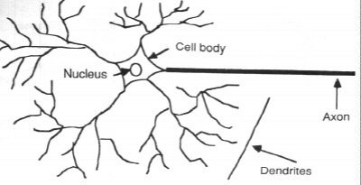
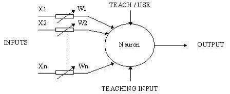
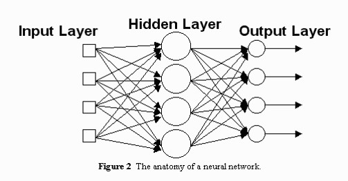
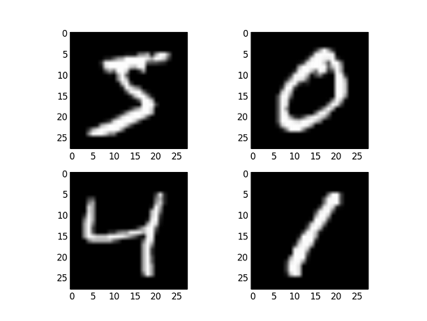

### Neural Networks
---
### What are neural networks?

A computer modeling approach to computation that is loosely based upon the architecture of the brain.

* Multiple, individual “nodes” or “units” that operate at the same time (in parallel)
* A network that connects the nodes together
* Information is stored in a distributed fashion among the links that connect the nodes
* Learning can occur with gradual changes in connection strength
---
### Biological Inspiration

Idea : To make the computer more robust, intelligent, and learn, …
Let’s model our computer software (and/or hardware) after the brain

---
### Neurons in the Brain
* A neuron receives input from other neurons (generally thousands) from its synapses
* Inputs are approximately summed
* Input travels from the body, down the axon, to the next neuron(s)


---
### Computer Model
* The neuron takes in a bunch of inputs
* The inputs are weighted.
* The weight of the input is a number which is multiplied with the input to give the weighted input. 
* The weighted inputs are then added together and passed onwards


---
### Bias
**Problem**: If the input array is all zeroes, our output has to be 0.

We add a **bias** to the output


---
### Java Implementation
```
public double calculate(double[] inputs){
  double output = 0;
  for(int i = 0; i < inputs.length; i++){
    output += inputs[i] * this.weights[i];
  }
  output += this.bias;
  
  return output;
}
```
---
### Training Process
* Randomly assign weights (between 0-1)
* We nudge weights to give results toward our desired output
* Repeat; stop when no errors, or enough epochs completed
---
### Neural Network 

---
### Neural Network (cont)
**Input Layer** - The data that is fed into the network.  
<br>
**Hidden Layer** - The layer of neurons in the middle. Their inputs are the outputs of the input layer.  
<br>
**Output Layer** - The final layer of neurons. Their inputs are the outputs of the hidden layer.
---
### Tensorflow
> High level API that does everything for you
```
output = tf.layers.dense(input, 10);
```
---
### MNIST
A database of handwritten digits.  

---
### Data format
>28 by 28 by 1  
(width, height, channels)
---
### First Model
[tinyurl.com/interlakeapcs](https://interlake-ssm.herokuapp.com/)
---
### Credits
https://www.math.uaa.alaska.edu/~afkjm/cs405/handouts/NN.ppt
https://www.d.umn.edu/~alam0026/NeuralNetwork.ppt
https://www.tensorflow.org/tutorials/